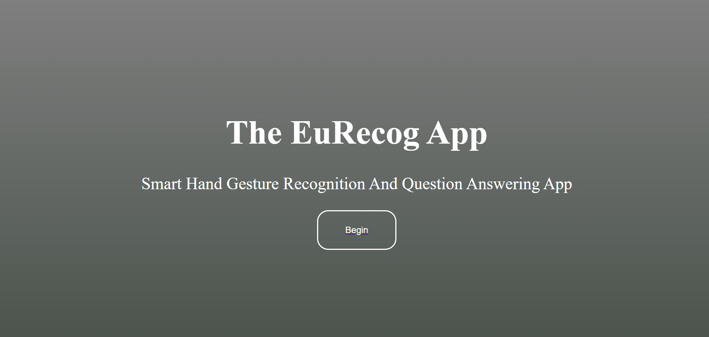
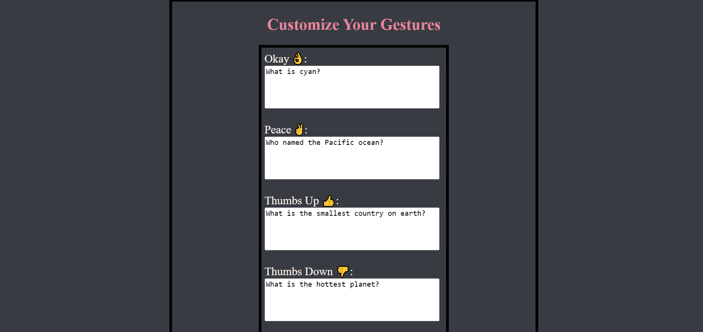
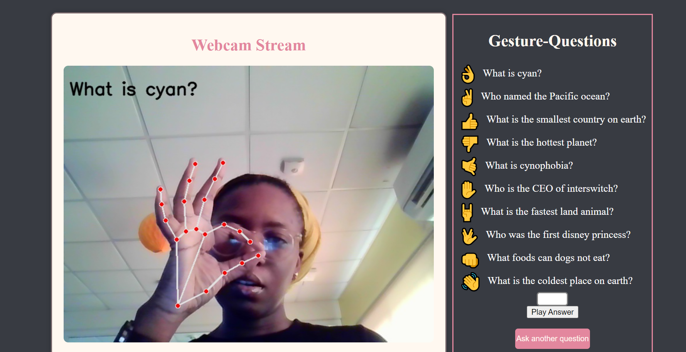
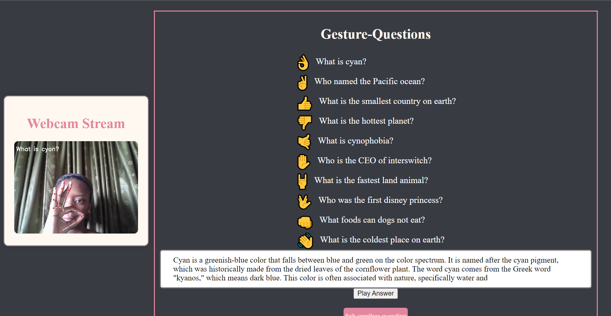
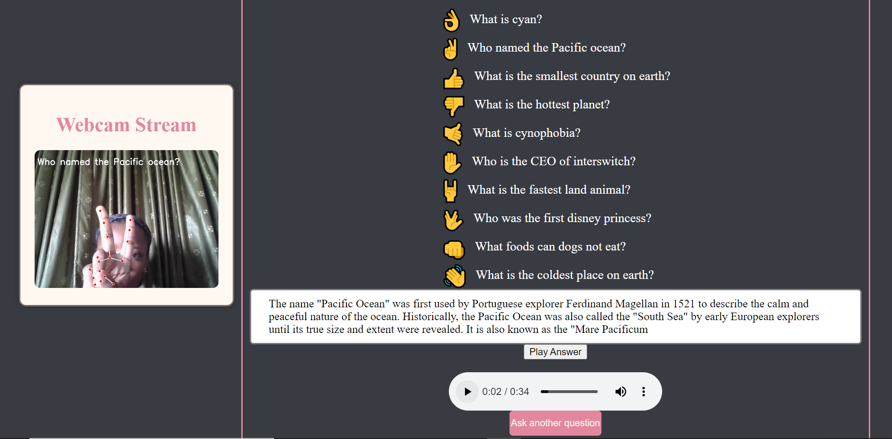

# The-EuRecog-Gesture-Recognition-App
The EuRecog gesture recognition app is a hand gesture recognition system that lets a user customize ten unique hand gesture signs with questions, then based on the gesture provided by said user in usage sends the question attached to that gesture to an LLM (Open AI's gpt-3.5-turbo-instruct) then provides an answer in both text and audio form.

# Table Of Contents
* [Installation](https://github.com/Jess607/The-EuRecog-Gesture-Recognition-App#installation)
* [About the Project](https://github.com/Jess607/The-EuRecog-Gesture-Recognition-App#about-the-project)
* [How It Works](https://github.com/Jess607/The-EuRecog-Gesture-Recognition-App#how-it-works)
* [File Description](https://github.com/Jess607/The-EuRecog-Gesture-Recognition-App#file-description)
* [Licensing And Authors](https://github.com/Jess607/The-EuRecog-Gesture-Recognition-App#licensing-and-authors)

# Installation 
The code requires:
* `python 3 and above`
* `flask`
* `mediapipe`
* `gtts` 
* `tensorflow` 
* `numpy`

# About The Project 
The advent of object detection and smart gesture recognition systems has further shown the extent of the amazing potential of artificial intelligence systems. Combining computer vision processes with natural language processing (NLP) systems would prove to be even more phenomenal than what each system could achieve individually. In this project, we leverage of a pre built hand gesture recognition model called `mp hand gesture` in conjunction with the mediapipe and tensorflow libraries. Mediapipe is used to note landmarks on palms which are used to recognize gestures being made. Tensorflow is used to load the prebuilt gesture recognition model. The model includes ten hand gestures each with its individual meaning. To make things interesting, we give users the ability to edit each gesture to questions which are then sent to a large language model(particularly OPENAI's gpt-3.5-turbo-instruct) for answers. In order to make use of this llm, it is important users have access to a valid `OPENAI API key` to make calls to the endpoint. Utilizing gTTS (google text-to-speech), audio versions of text responses are also provided to users. 
Every feature is packaged in a flask app using HTML/CSS and some javascript for its UI. 

# How It Works
When users login the app, they are met with a simple homepage containing the name of the app and a prompt to begin the experience. 

Upon clicking begin, users are given the opportunity to customize the gestures put forward by the model. Each gesture represents a question that could potentially be asked. There are questions provided as placeholders in case users decide to not edit.

After customizing gestures, the user may then click the start webcam button. 

Next, the webcam starts and users make the gestures at the camera which captures these gestures and returns the accompanying questions attached to them on the screen. The capture of gestures sends this question to the LLM for an answer. 

Answers generated are displayed as text.

In addition users have the option of getting an audio response by simply clicking on the 'play answer' button.

# File Description 
The folder contains:
* `mp_hand_gesture folder` that contains the code for the gesture recognition model
* `templates folder` that contains the html files used to create the user interface of the flask application
* `app.py` the code for the flask application
* `chat.py` the code for getting the result from the llm 
* `data.pickle` data used in the gesture recognition model
* `gesture.names` an editable .names file used in attaching questions to gestures.
* `welcome.mp3` the audio response generated from the llm response. 

# Licensing And Authors
This code was created by Jessica Ogwu under the Apache 2.0 license. Please feel free to use the resources as you deem fit.